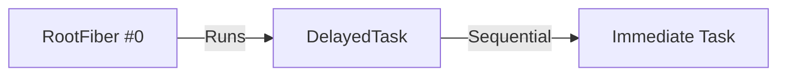
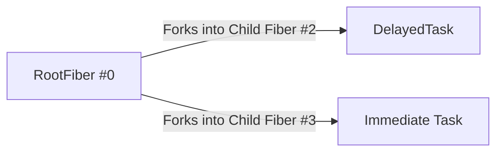
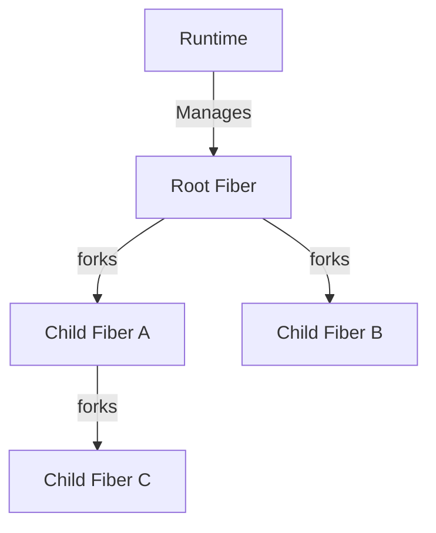
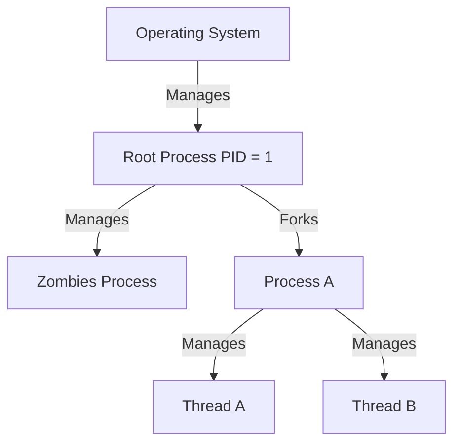
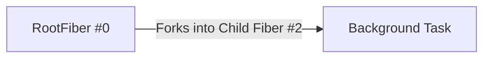
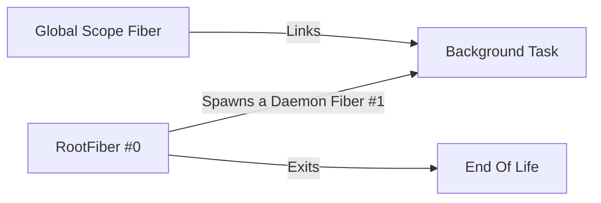
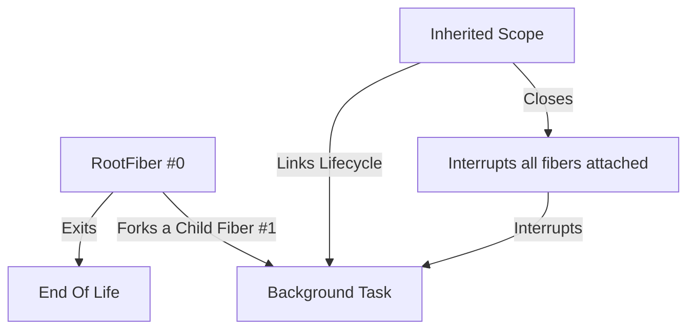
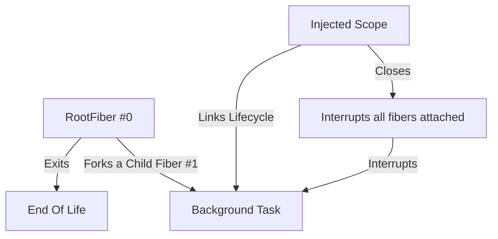

---
# try also 'default' to start simple
theme: default
# random image from a curated Unsplash collection by Anthony
# like them? see https://unsplash.com/collections/94734566/slidev
background: https://images.unsplash.com/photo-1533134486753-c833f0ed4866?q=80&w=2070&auto=format&fit=crop&ixlib=rb-4.0.3&ixid=M3wxMjA3fDB8MHxwaG90by1wYWdlfHx8fGVufDB8fHx8fA%3D%3D
# apply any windi css classes to the current slide
class: 'text-center'
# https://sli.dev/custom/highlighters.html
highlighter: shiki
# show line numbers in code blocks
lineNumbers: false
# some information about the slides, markdown enabled
info: |
  ## Antoine Coulon, Effect Paris # 3
  
  Les Fibers décryptées : la force cachée derrière Effect
# persist drawings in exports and build
drawings:
  persist: false
# use UnoCSS (experimental)
css: unocss
---

## **Les Fibers décryptées : la force cachée derrière Effect**

<br>

<h4 class="mt-10">
  Antoine Coulon @ Effect Paris #3 - 05/11/2024
</h4>

---

<div class="grid grid-cols-10 gap-x-4 pt-5 pr-10 pl-10">

<div class="col-start-1 col-span-7 grid grid-cols-[3fr,2fr] mr-10">
  <div class="pb-4">
    <h1><b>Antoine Coulon</b></h1>
    <div class="leading-8 mt-8 flex flex-col">
      <p class="mt-3">Lead Software Engineer @ <b color="cyan">evryg</b></p>
      <p class="mt-3">Créateur <b color="cyan">skott</b></p>
      <p class="mt-3">Auteur <b color="cyan">effect-introduction</b> </p>
      <p class="mt-3">Advocate <b color="cyan">Effect</b></p>
      <p class="mt-3">Contributeur <b color="cyan">Rush.js, NodeSecure</b></p>
    </div>  
  </div>
  <div class="border-l border-gray-400 border-opacity-25 !all:leading-12 !all:list-none my-auto">
  </div>

</div>

<div class="pl-20 col-start-8 col-span-10">
  

  <div class="mt-5">
    <div class="mb-4 flex justify-between"><ri-github-line color="blue"/> <b color="opacity-30 ml-2">antoine-coulon</b></div>
    <div class="mb-4 flex justify-between"><ri-twitter-line color="blue"/> <b color="opacity-30 ml-2">c9antoine</b></div>
    <div class="mb-4 flex justify-between">LinkedIn: <b color="opacity-30 ml-2">Antoine Coulon</b></div>
    <div class="mb-4 flex justify-between"><ri-user-3-line color="blue"/> <b color="opacity-30 ml-2">dev.to/antoinecoulon</b></div>
  </div>
</div>

</div>

<style>
  h1 {
    color: #4c7fff;
  }
  img {
    margin: 0 auto;
  }
</style>

---

## **Les fondations d'Effect**

<br>

- La nature d'un Effect 

- Les fondamentaux du runtime Effect

- Qu'est-ce qu'une Fiber ?

---

## **La différence fondamentale entre un Effect et une Promise**

<br>

```js
const promise = Promise.resolve(1)

const effect = Effect.succeed(1)
```

<div v-click>

```js
const promise = new Promise((resolve) => {
    console.log('Promise')
    resolve(1)
})

const effect = Effect.sync(() => {
    console.log('Effect')
    return 1
}) 
```
</div>

<div v-click>
```bash
$ tsx Program.ts
> Promise
```

</div>


---

## **La stratégie d'évaluation**

Une Promise est : 
- évaluée <b color="blue">eagerly</b>
- représente déjà une <b color="blue">opération en cours</b>

Un Effect est :
- évalué <b color="blue">lazily</b>
- représente la <b color="blue">description d'une opération</b> 
- est une <b color="blue">data structure immuable</b>

---

## **Un Effect est une description d'un programme**

Le concept des Programs as Values dont le principe est de séparer :
- la <b color="blue">description</b> d'un programme (being)
- de son <b color="blue">interprétation</b> (doing)

<div v-click>
<br>
Description (being)
```ts
const program = Effect.sync(() => 1)

console.log(program)
```

```json
{
  _id: 'Effect',
  _op: 'Sync',
  effect_instruction_i0: [Function (anonymous)],
  effect_instruction_i1: undefined,
  effect_instruction_i2: undefined
}
```


</div>

--- 

## **La description du programme TypeScript avec le DSL Effect**

Effect est un <b color="blue">Domain Specific Language</b>
- <b color="blue">Embedded</b>, s'intègre à un hôte en l'occurrence TypeScript

- Utilise un <b color="blue">encoding initial</b>, c'est à dire que la description est séparée de l'interprétation : possibilité d'avoir plusieurs interpréteurs pour une même description

```ts
// Décrit avec TypeScript
const program = Effect.sync(() => {})

// Dont l'interprétation est déléguée
interpreter1.run(program)

interpreter2.run(program)

// interpreter3 etc...
```

---

## **Passer de la description à l'interprétation**

```ts {3|4-10|12-13|14-25} {lines:true}
import { Effect } from "effect"

const program = Effect.sync(() => {})
const primitive = {
  _id: "Effect",
  _op: "Sync",
  effect_instruction_i0: Function,
  effect_instruction_i1: undefined,
  effect_instruction_i2: undefined,
}

export const DumbRuntime = {
  runSync: <A, E>(program: Effect.Effect<A, E, never>) => {
    const effect = program as {
      _op: "Sync";
      effect_instruction_i0: () => unknown;
    };

    switch (effect._op) {
      case "Sync": {
        return effect.effect_instruction_i0()
      }
    }
  }
}
```

---

### **Ce qu'il se passe dans le vrai runtime Effect**

https://github.com/Effect-TS/effect/blob/8a30e1dfa3a7103bf5414fc6a7fca3088d8c8c00/packages/effect/src/internal/fiberRuntime.ts#L1358

```ts {3} {lines:true}
cur = this.currentTracer.context(() => {
  // [...]
  return this[(cur as core.Primitive)._op](cur as core.Primitive);
}, this);
```

```ts
/** @internal */
export type Primitive =
  | Async | Commit
  | Failure | OnFailure
  | OnSuccess | OnStep
  | OnSuccessAndFailure | Success | Sync
  | UpdateRuntimeFlags | While | WithRuntime | Yield
  | OpTag | Blocked | RunBlocked | Either.Either<any, any>
  | Option.Option<any>
```

---

## **Et il reste à implémenter...**

<br>

- Concurrency
- Resource Safety
- Stack Safety
- Error management
- Performance
- etc.

---

## **Fiber : la primitive au coeur du runtime**

Une Fiber est une unité d'exécution d'un programme qui est:

- Lightweight : assimilée à un virtual/green thread, faible coût de manipulation
- Non-blocking : faite pour gérer efficacement la concurrence (cooperative multitasking)
- Est en charge de l'exécution d'un ou plusieurs Effects durant son cycle de vie
- Low-level : principalement orchestrée via des opérateurs high-level, mais peut être directement contrôlée
- Stateful : started, suspended, interrupted

---

## **L'exécution d'un Effect est inévitablement liée à une Fiber**

<br>

```ts
import { Effect } from "effect"

const log = Effect.log(`Something happening...`)

Effect.runSync(log)
```

<div v-click>
L'exécution d'un Effect est forcément liée à une Fiber

```bash
$ tsx Program.ts
> timestamp=2024-11-04T08:44:16.166Z level=INFO fiber=#0 message="Something happening..."
```
</div>

---

## **La manipulation indirecte de Fibers #1**

```ts
pipe(
  Effect.log("Delayed Task"),
  Effect.delay(1000),
  Effect.zip(Effect.log("Immediate Task"))
)
```



```bash
timestamp=2024-11-04T09:00:59.584Z level=INFO fiber=#0 message="Delayed Task"
timestamp=2024-11-04T09:00:59.589Z level=INFO fiber=#0 message="Immediate Task"
```

---

## **La manipulation indirecte de Fibers #2**

```ts
pipe(
  Effect.log("Delayed Task"),
  Effect.delay(1000),
  Effect.zip(Effect.log("Immediate Task"), { concurrent: true })
)
```



```bash
timestamp=2024-11-04T09:09:08.617Z level=INFO fiber=#3 message="Immediate Task"
timestamp=2024-11-04T09:09:09.619Z level=INFO fiber=#2 message="Delayed Task"
```

---

## **Un runtime Fiber-based régi par la Structured Concurrency** 

- Conceptualise un modèle hiérarchique pour l'ensemble des tâches
- Offre des garanties fortes : gestion d'erreurs, scope et cycle de vie maitrisés
- Peut être assimilé à la représentation d'un Process Tree d'un système d'exploitation

<div class="grid grid-cols-2 gap-x-4">
<div>

</div>

<div>

</div>
</div>


---

## **La manipulation directe de Fibers**

<br>

- fork
- forkDaemon
- forkScoped
- forkIn

---

<b color="blue">Effect.fork</b>: forks une child fiber, reliée au cycle de vie de la parent fiber

<div class="grid grid-cols-2 gap-x-4">

<div>
```ts {all|17} {lines:true}
const background = pipe(
  Effect.log("background"),
  Effect.repeat(Schedule.spaced("5 second"))
);

const foreground = pipe(
  Effect.log("foreground"),
  Effect.repeat(
    { 
      times: 2, 
      schedule: Schedule.spaced("1 second") 
    }
  )
);

const program = Effect.gen(function* () {
  yield* Effect.fork(background);
  yield* foreground.pipe(
    Effect.onExit(() => Effect.log("Bye"))
  );
});

program.pipe(Effect.runFork);
```
</div>

<div>




```bash
timestamp=2024-11-04T09:33:00.303Z level=INFO fiber=#0 message=foreground
timestamp=2024-11-04T09:33:00.305Z level=INFO fiber=#1 message=background
timestamp=2024-11-04T09:33:01.309Z level=INFO fiber=#0 message=foreground
timestamp=2024-11-04T09:33:02.314Z level=INFO fiber=#0 message=foreground
timestamp=2024-11-04T09:33:02.317Z level=INFO fiber=#0 message=Bye
```

</div>

</div>

---

<b color="blue">Effect.forkDaemon</b>: forks une fiber, reliée à une root fiber, détachée du parent

<div class="grid grid-cols-2 gap-x-4">

<div>
```ts {all|17} {lines:true}
const background = pipe(
  Effect.log("background"),
  Effect.repeat(Schedule.spaced("5 second"))
);

const foreground = pipe(
  Effect.log("foreground"),
  Effect.repeat(
    { 
      times: 2, 
      schedule: Schedule.spaced("1 second") 
    }
  )
);

const program = Effect.gen(function* () {
  yield* Effect.forkDaemon(background);
  yield* foreground.pipe(
    Effect.onExit(() => Effect.log("Bye"))
  );
});

program.pipe(Effect.runFork);
```
</div>

<div>




```bash
timestamp=2024-11-04T09:50:34.039Z level=INFO fiber=#0 message=foreground
timestamp=2024-11-04T09:50:34.042Z level=INFO fiber=#1 message=background
timestamp=2024-11-04T09:50:35.046Z level=INFO fiber=#0 message=foreground
timestamp=2024-11-04T09:50:36.049Z level=INFO fiber=#0 message=foreground
timestamp=2024-11-04T09:50:36.052Z level=INFO fiber=#0 message=Bye
timestamp=2024-11-04T09:50:39.043Z level=INFO fiber=#1 message=background
```

</div>

</div>

---

<b color="blue">Effect.forkScoped</b>: forks une child fiber, reliée au scope courant (hérité)

<div class="grid grid-cols-2 gap-x-4">

<div>

```ts {all|3|2,17} {lines:true}
const program = Effect.gen(function* () {
      // ^ Effect.Effect<void, never, Scope>
  yield* Effect.forkScoped(background)

  yield* foreground.pipe(
    Effect.onExit(() => Effect.log("Bye from Foreground"))
  )
});

program.pipe(
    Effect.zip(
      pipe(
        Effect.log('Closing scope')
        Effect.delay("10 second"),
      )
    ),
    Effect.scoped,
    Effect.runFork
)
```

</div>

<div>




```bash
timestamp=2024-11-04T10:08:03.277Z level=INFO fiber=#0 message=foreground
timestamp=2024-11-04T10:08:03.280Z level=INFO fiber=#0 message="Bye from Foreground"
timestamp=2024-11-04T10:08:06.273Z level=INFO fiber=#1 message=background
timestamp=2024-11-04T10:08:11.277Z level=INFO fiber=#1 message=background
timestamp=2024-11-04T10:08:13.286Z level=INFO fiber=#0 message="Closing scope"
```

</div>

</div>


---

<b color="blue">Effect.forkIn</b>: forks une child fiber, reliée au scope fourni

<div class="grid grid-cols-2 gap-x-4">

<div>

```ts {all|1,3,8,12,18} {lines:true}
const program = (scope: Scope.Scope) =>
  Effect.gen(function* () {
    yield* Effect.forkIn(scope)(background);
  });

pipe(
  Effect.gen(function* () {
    const scope = yield* Scope.make();

    yield* Effect.forkDaemon(
      pipe(
        Scope.close(scope, Exit.void),
        Effect.zip(Effect.log("Scope closed")),
        Effect.delay("3 second")
      )
    );

    yield* program(scope);
  }),
  Effect.runFork
);
```

</div>

<div>




```bash
timestamp=2024-11-04T10:37:43.416Z level=INFO fiber=#2 message=background
timestamp=2024-11-04T10:37:44.422Z level=INFO fiber=#2 message=background
timestamp=2024-11-04T10:37:45.426Z level=INFO fiber=#2 message=background
timestamp=2024-11-04T10:37:46.425Z level=INFO fiber=#1 message="Scope closed"
```

</div>

</div>


---

## **Effect in a nutshell**

<br>

- Effect sépare la Description (being) de l'évaluation (doing)
- Un Effect décrit un programme à l'aide d'un DSL qui compose une structure de données immuable et lazy
- Le runtime natif Effect est fiber-based et utilise la Structured Concurrency 
- Les Fibers sont orchestrées par le runtime et contrôlées via des actions directes/indirectes

---

## **Merci d'avoir écouté !**

- **Effect website**: <b color="cyan">https://effect.website</b>
  
- **Effect introduction**: <b color="cyan">https://github.com/antoine-coulon/effect-introduction</b>


<br>

### Questions ?
